# المنصة الوطنية للمبادرات الصناعية
## ملف الفهم الموحد للتيم

> هذا الملف هو المرجع الأول لأي عضو جديد في الفريق.
> اقرأه من الأول للآخر قبل أي اجتماع تخطيط.

**طريقة القراءة:**
- كل قسم فيه فكرة واحدة + رسمة واحدة + جدول واحد.
- الرسومات مرسومة بمكتبة ميرميد. لو فاتح الملف على جيت هب ستظهر مرسومة. لو فاتحه نص ستجد الشرح تحتها.
- أي مصطلح إنجليزي ستجده بين علامتين مثل `Workflow` حتى لا يتلخبط اتجاه الكلام.

---

## 1. احنا بنبني ايه بالظبط

**جملة واحدة تحفظها:**

> نحن نبني مصنعا للمبادرات. وليس نظاما لمبادرة واحدة.

**مثال يقرب الفكرة:**

- المبادرة الشمسية الموجودة في الصورة هي مجرد مثال.
- بكرة الوزارة ممكن تعمل مبادرة تحديث خطوط إنتاج.
- وبعده مبادرة دعم صادرات.
- الثلاثة مختلفين تماما في الشروط والورق والخطوات والجهات.
- ومع ذلك يعملون على نفس النظام بدون كود جديد.

**القاعدة الذهبية:**

> الادمن هو من يصنع المبادرة من لوحة التحكم.
> المطور صنع الموتور مرة واحدة فقط.

---

## 2. خمس معادلات تحكم كل قرار

| رقم | المعادلة | معناها بكلام بسيط |
|-----|----------|-------------------|
| 1 | المبادرة تساوي إعدادات | المبادرة شوية اختيارات يجمعها الادمن. ليست برمجة |
| 2 | المسار يساوي موتور | `Workflow` هو موتور مرن يمشي عليه أي طلب |
| 3 | الطلب يساوي نسخة شغالة | `Application` هو مشوار مصنع واحد داخل الموتور |
| 4 | المصنع يساوي ملف واحد | المصنع يسجل مرة واحدة فقط. وبعدها نسحب بياناته تلقائيا |
| 5 | الصلاحية تساوي خمسة أبعاد | الدور وحده لا يكفي. لازم نعرف الجهة والمبادرة والمرحلة ونوع البيانات |

**ممنوعات معمارية:**

- ممنوع تثبيت اسم مرحلة في الكود.
- ممنوع تثبيت اسم جهة في الكود.
- ممنوع تثبيت حقل فورم في الكود.
- كل ما سبق يأتي من قاعدة البيانات.

---

## 3. المنصة شقان فقط

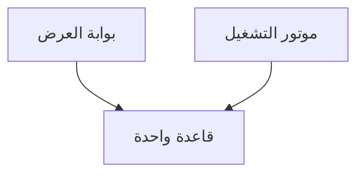

**الشرح:**

| الشق | اسمه | وظيفته | مثال |
|-----|------|--------|------|
| الأول | بوابة العرض `Showcase` | المصنع يكتشف المبادرات قبل التقديم | كتالوج. فلاتر. صفحة المبادرة. حاسبة الأهلية. المقارنة |
| الثاني | موتور التشغيل `Engine` | إدارة الطلب بعد التقديم | الفورم. المراحل. الاعتمادات. المستندات. التنبيهات |

الشقان يقرآن ويكتبان في نفس قاعدة البيانات. لا يوجد نظامان منفصلان.

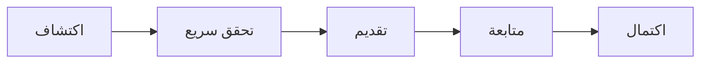

1. اكتشاف: يتصفح الكتالوج.
2. تحقق سريع: يجيب على ثلاثة أسئلة. يعرف هل هو مؤهل أم لا.
3. تقديم: يدوس قدم. بياناته مسحوبة جاهزة.
4. متابعة: يرى طلبه في أي مرحلة ومطلوب منه ايه.
5. اكتمال: يخلص ويظهر في التقارير.

---

## 4. دورة حياة الطلب مبسطة

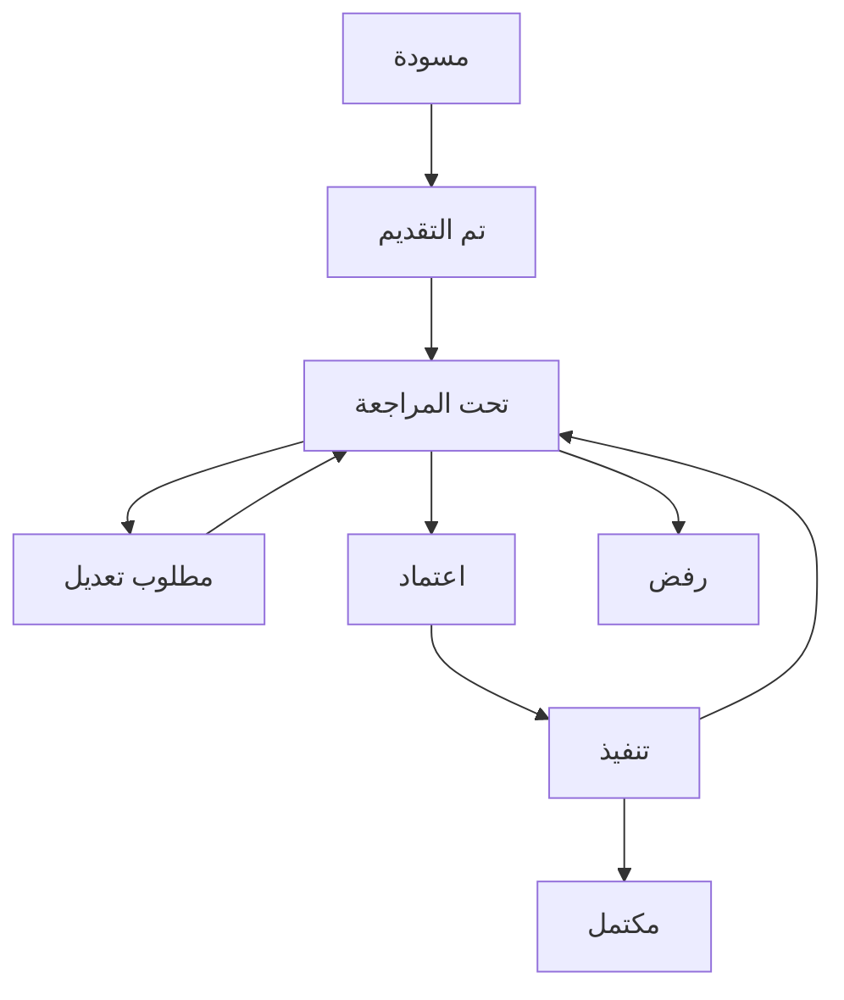

**الشرح سطر سطر:**

- مسودة: المصنع يجهز ولم يرسل بعد.
- تم التقديم: وصل للجهة الأولى.
- تحت المراجعة: عند مراجع الآن.
- مطلوب تعديل: رجع للمصنع. يكمل ويرجع تاني للمراجعة.
- اعتماد: عدت المرحلة. تدخل اللي بعدها.
- رفض: اتقفل بسبب موثق.
- تنفيذ: شغل على الأرض مثل التركيب.
- مكتمل: خلص كل المراحل.

**مثال الطاقة الشمسية فقط للتوضيح:**

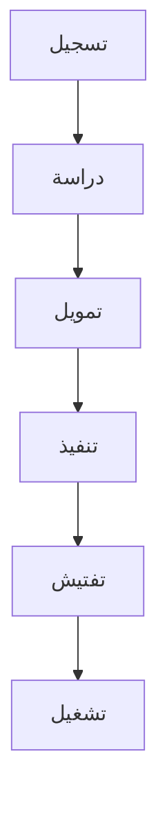

- لو غيرنا أسماء المراحل غدا من الادمن. الرسم يتغير بدون كود.
- كل مرحلة لها جهة مسؤولة ومدة محددة.

---

## 5. المبادرة عبارة عن سبعة أجزاء

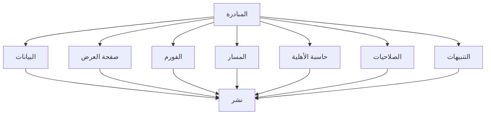

| الجزء | سؤال يجيب عنه | مثال |
|------|---------------|------|
| البيانات | ما اسم المبادرة وما هدفها | الاسم بالعربي والإنجليزي. الوصف. القطاعات. المحافظات |
| صفحة العرض | ماذا يرى المصنع قبل التقديم | الغلاف. المزايا. الأسئلة الشائعة. دليل الشروط |
| الفورم | ما الأسئلة المطلوبة | حقول نص ورقم وملفات وشروط ظهور |
| المسار | ما الخطوات ومن المسؤول | خمس مراحل. كل مرحلة جهة ومدة |
| حاسبة الأهلية | هل أكمل أم لا | ثلاثة أسئلة سريعة |
| الصلاحيات | من يرى ماذا | البنك يرى طلباته فقط |
| التنبيهات | متى نرسل رسالة | عند الاعتماد أو التأخير |

بعد التجميع يدوس الادمن نشر `Publish`.
ولو عدل بعد النشر تخرج نسخة جديدة `V2`. والطلبات القديمة تكمل على `V1`.

---

## 6. الموتور على جزأين: رسم ثم تشغيل

**الجزء الأول: الرسم. يفعله الادمن مرة واحدة.**

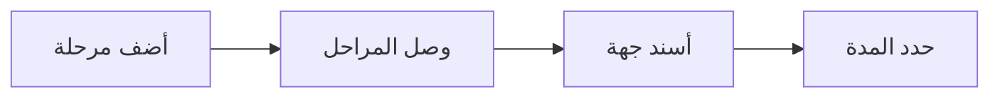

**الجزء الثاني: التشغيل. يحدث تلقائيا مع كل طلب.**

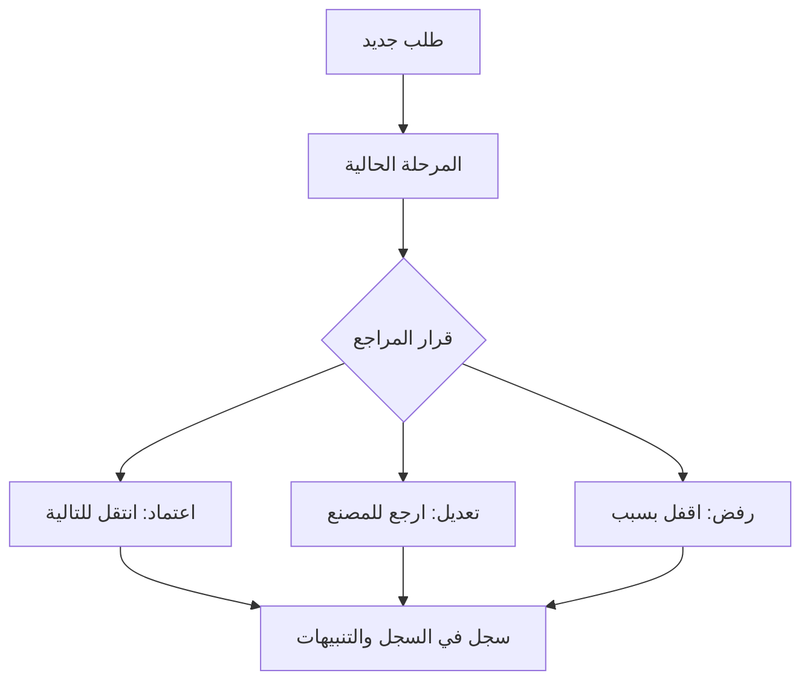

**ثلاث قواعد لا تنكسر:**

1. كل طلب مستقل عن الآخر.
2. تعديل الرسم لا يكسر طلبا قديما.
3. كل قرار يسجل: من فعلها. متى. لماذا. وبأي مستند.

---

## 7. المصنع يسجل مرة واحدة فقط

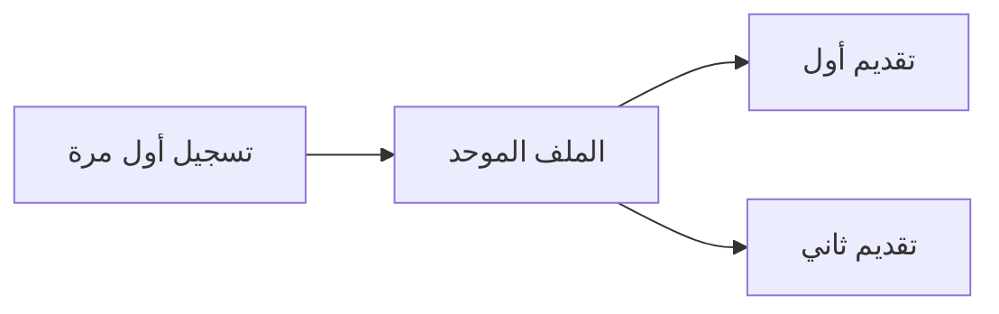

- أول مرة: يدخل السجل التجاري والصناعي والبطاقة الضريبية والقطاع والمحافظة والطاقة.
- ثاني مرة: لا نساله نفس الأسئلة. نسأل فقط الجديد الخاص بالمبادرة الجديدة.
- مستنداته محفوظة في خزانة واحدة `Locker`.

---

## 8. الصلاحيات: من يرى ماذا

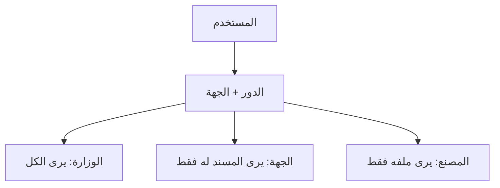

| من | ماذا يرى | مثال عملي |
|----|----------|-----------|
| مشرف الوزارة | كل المبادرات وكل الطلبات | لوحة شاملة |
| مراجع التحديث | الطلبات المسندة لجهته فقط | لا يرى طلبات البنك |
| موظف البنك | طلبات التمويل الخاصة ببنكه | لا يرى الدراسة الفنية التفصيلية لو ممنوعة |
| الشركة المنفذة | مشاريعها المسندة فقط | لا ترى بيانات مالية للبنك |
| المصنع | ملفه وطلباته فقط | لا يرى مصنعا آخر |
| مدقق قراءة فقط | تقارير بدون تعديل | لا يوجد له أي زر اعتماد |

**ملحوظة مهمة:** هناك صلاحية على مستوى الحقل.
مثال: الحقل المالي يظهر للبنك ويختفي عن الشركة. والتصدير يتبع نفس القاعدة.

---

## 9. ثلاثة محركات صغيرة: مستندات وتنبيهات ومواعيد

### المستندات

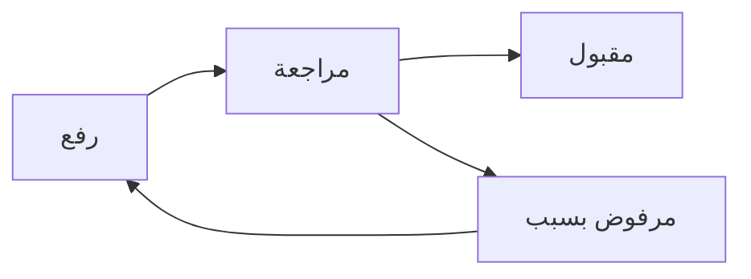

- كل مستند له نوع وحالة ونسخ.
- المستند مربوط بالمصنع والمبادرة والطلب والمرحلة معا.

### التنبيهات

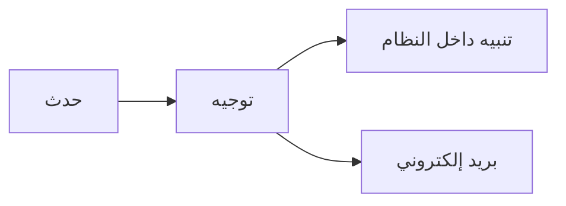

- الأحداث: تقديم. اعتماد. رفض. طلب مستند. تغير مرحلة. قرب انتهاء المدة.
- التنبيه يذهب لصاحب الشأن فقط. ليس للكل.

### المواعيد `SLA`

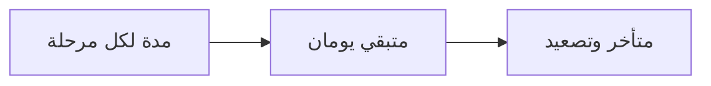

- مثال: الأهلية ثلاثة أيام. الدراسة خمسة. البنك سبعة.
- المتأخر يظهر باللون الأحمر ويتصعد للمدير.

---

## 10. فصل الشغل: الفرونت والباك

### 10.1 الباك اند هو العقل والحارس

| الموديول | شغل الباك اند | القاعدة |
|----------|---------------|---------|
| الدخول | تشفير. جلسات. حماية من التخمين | لا تثق في الفرونت |
| الجهات والمستخدمون | إنشاء. تفعيل. إيقاف. إسناد | الإيقاف يجمد المهام ولا يكسر الطلبات |
| الصلاحيات | فحص خماسي في كل طلب | أي تجاوز من الفرونت يترفض |
| المبادرات | دورة النشر والنسخ | النسخ تحافظ على القديم |
| النماذج | حفظ الهيكل والتحقق في السيرفر | تحقق الفرونت للسرعة فقط وليس للأمان |
| المسار | آلة الحالات وقفل النسخة وحساب المدد | تحريك المرحلة من السيرفر فقط |
| المستندات | رفع آمن. فحص النوع. نسخ. روابط مؤقتة | ممنوع روابط دائمة مكشوفة |
| التنبيهات | أحداث وطوابير وإرسال | الفرونت يعرض فقط |
| التقارير | تجميع وتصدير مع احترام الصلاحية | مستحيل تصدر ما لا تراه |
| السجل | سجل إلحاقي فقط. ممنوع التعديل والمسح | كل كتابة حساسة تسجل |

عقد الباك اند ثابت:
`واجهات ريست. أكواد حالة موحدة. شكل خطأ ثابت. ترقيم صفحات. فلترة وفرز.`

### 10.2 الفرونت اند هو الوضوح والسرعة

| المنطقة | شغل الفرونت اند | يعتمد على |
|---------|-----------------|-----------|
| نظام التصميم | الألوان. الخطوط. الأزرار. الجداول. دعم العربي | مستقل تماما |
| بوابة العرض | الكتالوج. الفلاتر. البطاقات. صفحة المبادرة | واجهات العرض العامة |
| بوابة المصنع | الملف. معالج التقديم. طلباتي. الخط الزمني | واجهات المصنع الخاصة |
| لوحة الادمن | المؤشرات. الجدول المركزي. شاشة المراجعة | واجهات الإدارة |
| الاستوديو | محرر الصفحة. باني الفورم. رسام المسار | واجهات البناء |
| الإطار العام | الهيدر. الفوتر. تبديل اللغة. حماية شكلية | الحماية الحقيقية في الباك |

> القاعدة: الفرونت يجمع ويعرض. الباك يقرر ويسمح ويسجل.

---

## 11. خريطة الصفحات كاملة

### المجموعة الأولى: صفحات عامة

| المسار | اسم الصفحة | المكونات |
|--------|------------|----------|
| `/` | الرئيسية والكتالوج | شريط علوي. عدادات الأثر. شريط فلترة. شبكة البطاقات |
| `/initiative/id` | صفحة المبادرة | الغلاف. المزايا. المراحل. المستندات. الأسئلة. زر قدم. حاسبة الأهلية |

يبنيها: الفرونت. وتحتاج واجهتي العرض العامة فقط.

### المجموعة الثانية: صفحات المصنع

| المسار | اسم الصفحة | المكونات |
|--------|------------|----------|
| `/factory/profile` | الملف الموحد | بيانات السجل. بيانات الطاقة. خزانة المستندات |
| `/factory/apply/id` | معالج التقديم | خطوات. حقول شرطية. رفع ملفات. مراجعة قبل الإرسال |
| `/factory/applications` | طلباتي | قائمة الطلبات. الحالة. الوقت المتبقي |
| `/factory/applications/id` | تفاصيل الطلب | الخط الزمني. المطلوب مني. سجل القرارات |

### المجموعة الثالثة: صفحات الوزارة والجهات

| المسار | اسم الصفحة | المكونات |
|--------|------------|----------|
| `/admin/dashboard` | لوحة المؤشرات | كروت الأرقام. رسوم. الاختناقات. المتأخرات |
| `/admin/applications` | جدول الطلبات | بحث. فلترة. فرز. إسناد. تصدير |
| `/admin/applications/id` | شاشة المراجعة | البيانات. المستندات. أزرار اعتماد ورفض وتعديل وتصعيد |
| `/admin/audit-logs` | سجل التدقيق | جدول الأحداث. فلترة بالتاريخ والمستخدم |

### المجموعة الرابعة: الاستوديو. صانع المبادرات

| المسار | التبويب | المكونات |
|--------|---------|----------|
| `/admin/initiatives/builder` | الأول: صفحة العرض | محرر الغلاف والمزايا والأسئلة |
| نفس المسار | الثاني: الفورم | إضافة الحقول. الشروط. التحقق |
| نفس المسار | الثالث: المسار | رسم المراحل. الوصلات. الإسناد. المدد |
| نفس المسار | الرابع: الأهلية | أسئلة الحاسبة السريعة |

---

## 12. قاعدة البيانات ببساطة

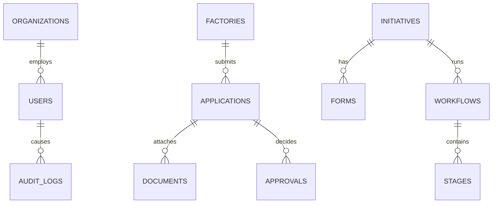

**الشرح بدون تعقيد:**

| الجدول | يخزن ايه |
|--------|----------|
| الجهات | الوزارة والهيئات والبنوك والشركات |
| المستخدمون | الحسابات والأدوار والإسنادات |
| المصانع | الملف الموحد لكل مصنع |
| المبادرات | تعريف كل مبادرة وإعدادات عرضها |
| النماذج والحقول | هيكل الأسئلة لكل مبادرة |
| المسارات والمراحل | الخطوات والوصلات والمدد |
| الطلبات | كل تقديم. مربوط بنسخة مسار ثابتة |
| المستندات | الملفات ونسخها وحالتها |
| الاعتمادات | كل قرار: من ومتى ولماذا |
| التنبيهات | الرسائل الموجهة |
| السجل | كل حدث حساس. إلحاق فقط |

---

## 13. شروط التسليم. خمسة وعشرون بندا

### الإدارة والإعداد. تسعة بنود

- [ ] دخول الادمن
- [ ] إنشاء الجهات
- [ ] إنشاء حسابات الجهات
- [ ] إنشاء الأدوار
- [ ] إنشاء مبادرة
- [ ] إعداد المبادرة
- [ ] بناء فورم ديناميكي
- [ ] رسم مسار
- [ ] نشر المبادرة

### التشغيل. تسعة بنود

- [ ] تسجيل مصنع
- [ ] تقديم طلب
- [ ] مراجعة الطلب
- [ ] اعتماد أو رفض
- [ ] إسناد لجهة
- [ ] رفع مستند
- [ ] تتبع الخط الزمني
- [ ] استلام تنبيه
- [ ] ظهور القرار في السجل

### العرض والتقارير. سبعة بنود

- [ ] داشبورد ادمن
- [ ] داشبورد جهة
- [ ] داشبورد مصنع
- [ ] تقارير
- [ ] تصدير إكسل مع احترام الصلاحية
- [ ] عربي وإنجليزي باتجاه صحيح
- [ ] يعمل على الكمبيوتر والتابلت والموبايل

---

## 14. خمسة مخاطر تقتل المشروع

| الخطر | الحل في سطر |
|------|-------------|
| تعديل المسار يكسر طلبا قديما | قفل النسخة. القديم يكمل. الجديد يبدأ على الجديدة |
| صلاحية في الفرونت فقط | الفحص في الباك في كل واجهة |
| سؤال المصنع نفس الأسئلة كل مرة | الملف الموحد والسحب التلقائي |
| ملفات كبيرة توقف النظام | تخزين خارجي وطوابير وترقيم |
| شكل مبهرج لا يشبه الحكومة | ألوان رصينة. كحلي وذهبي بحذر. بدون مبالغة |

---

*نهاية الملف. اقرأه مرة واحدة بتركيز. ثم ابدأ من قسم الصفحات حسب دورك: فرونت أو باك.*
